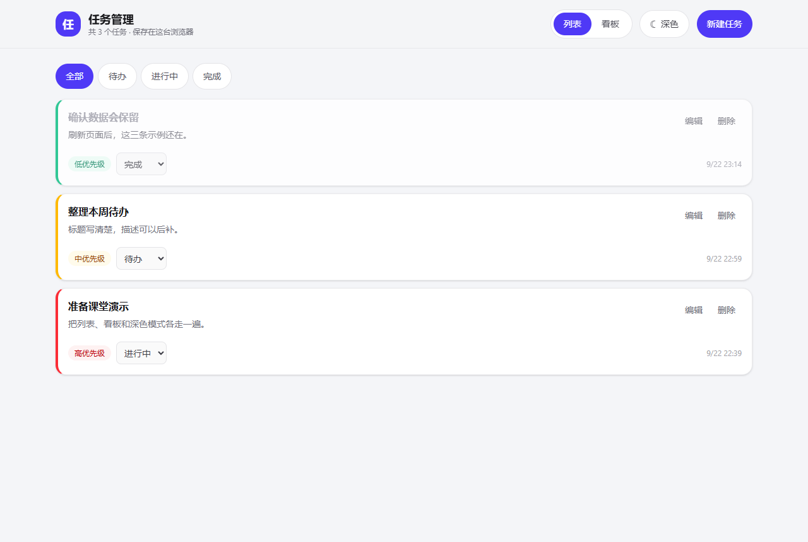
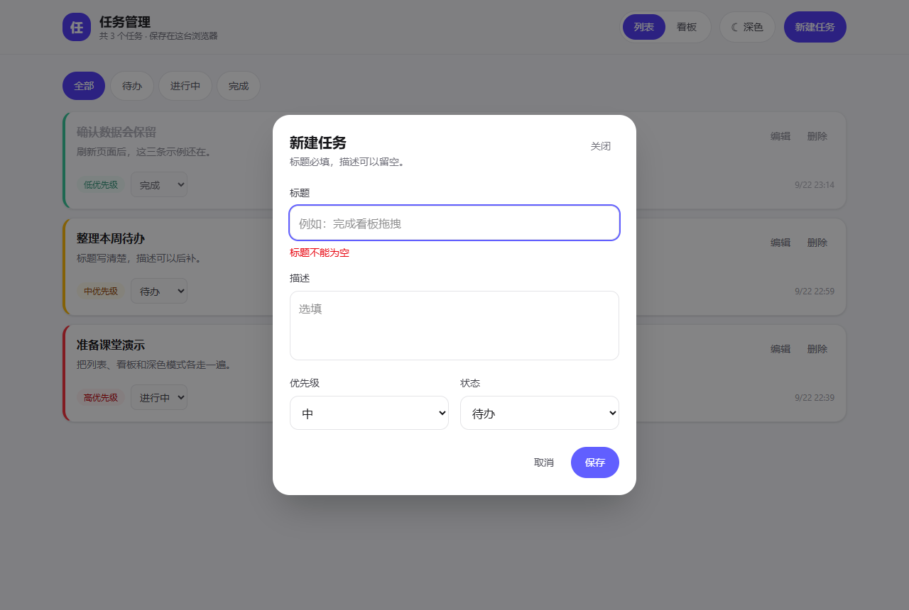
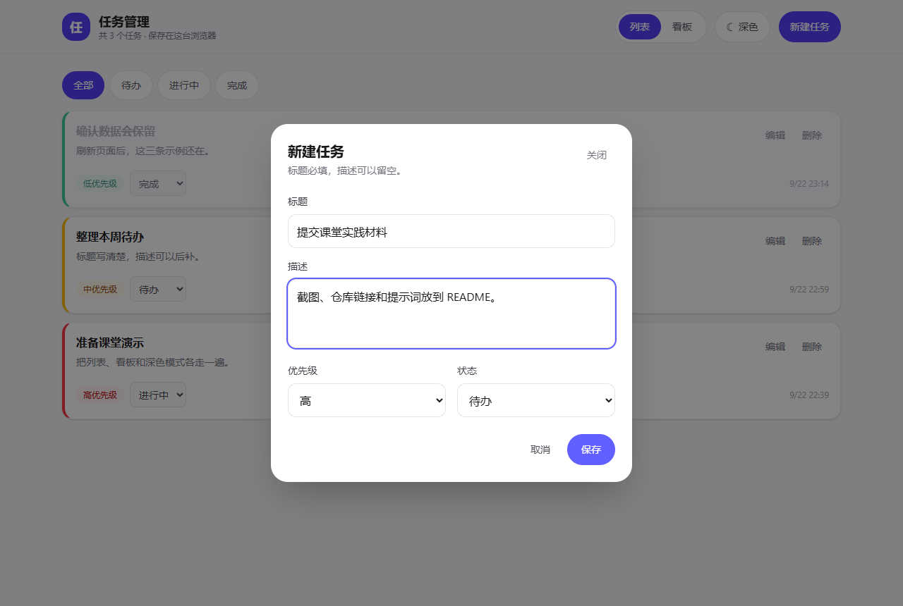
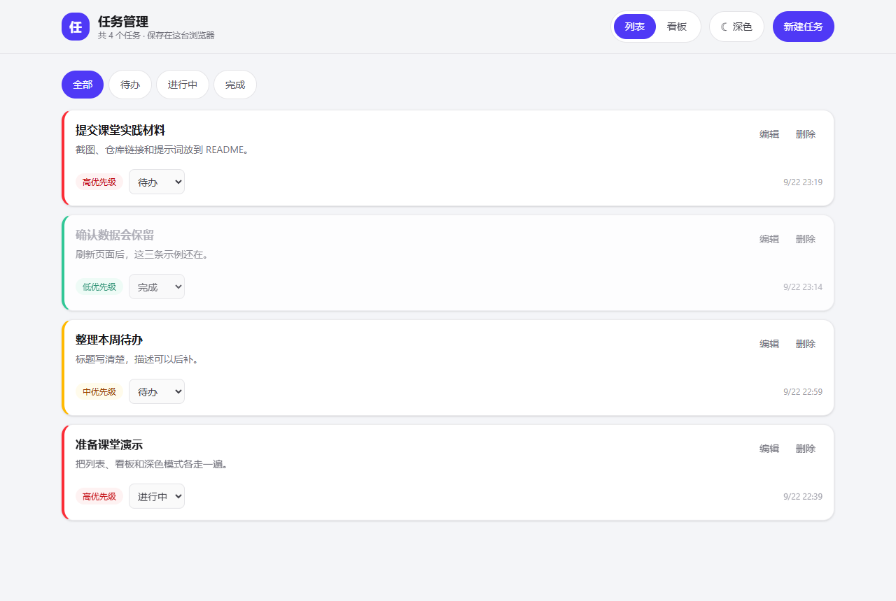
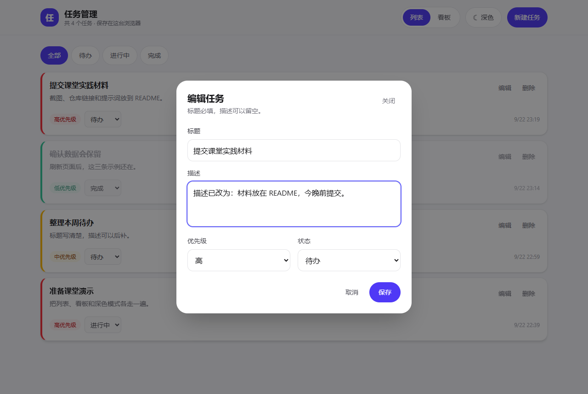
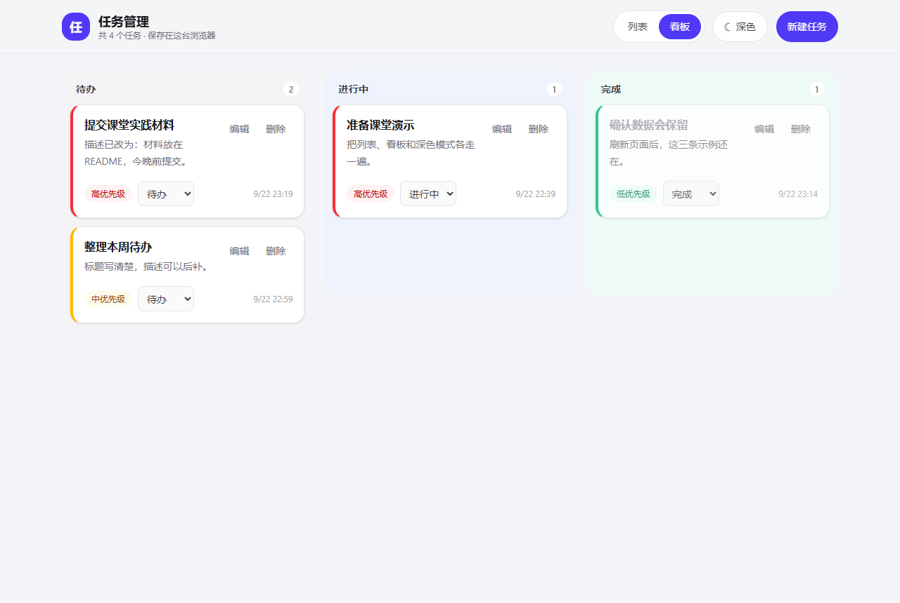
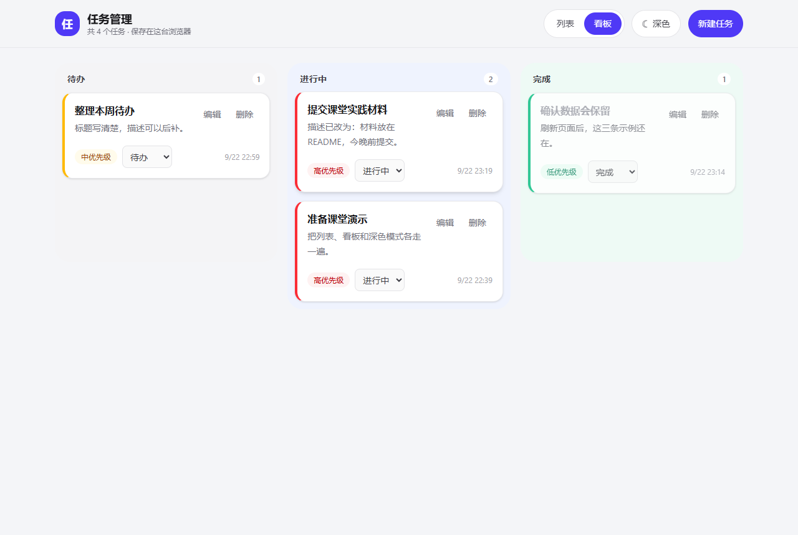
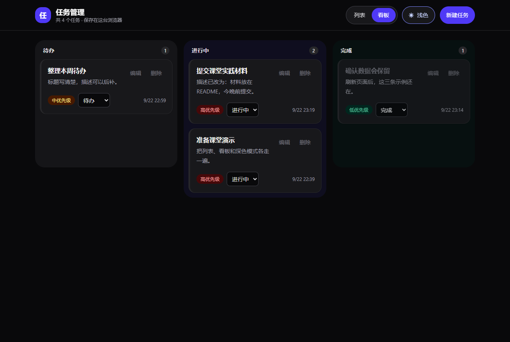
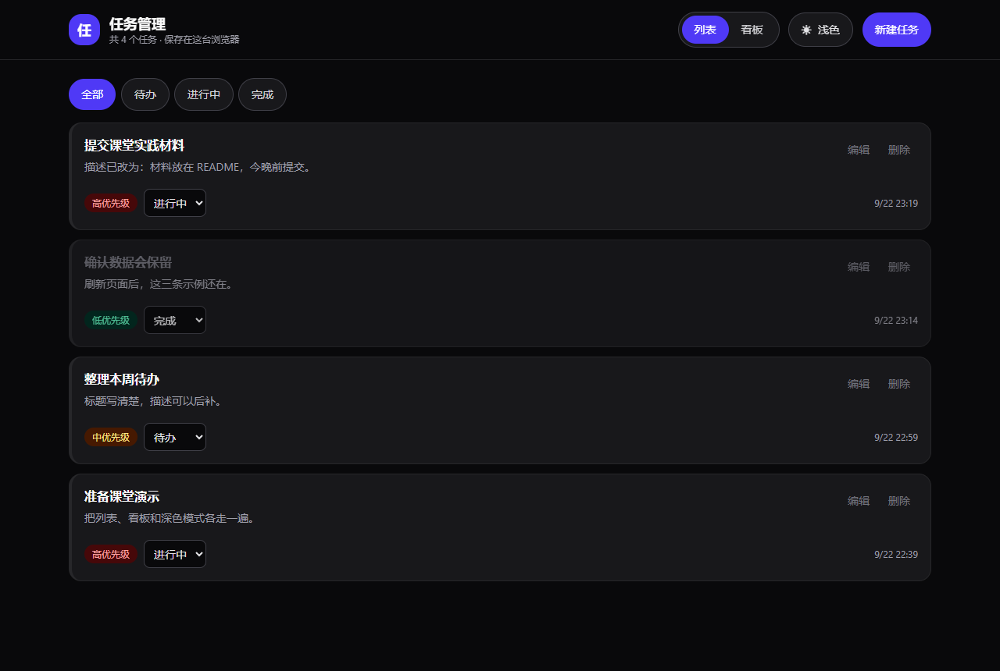
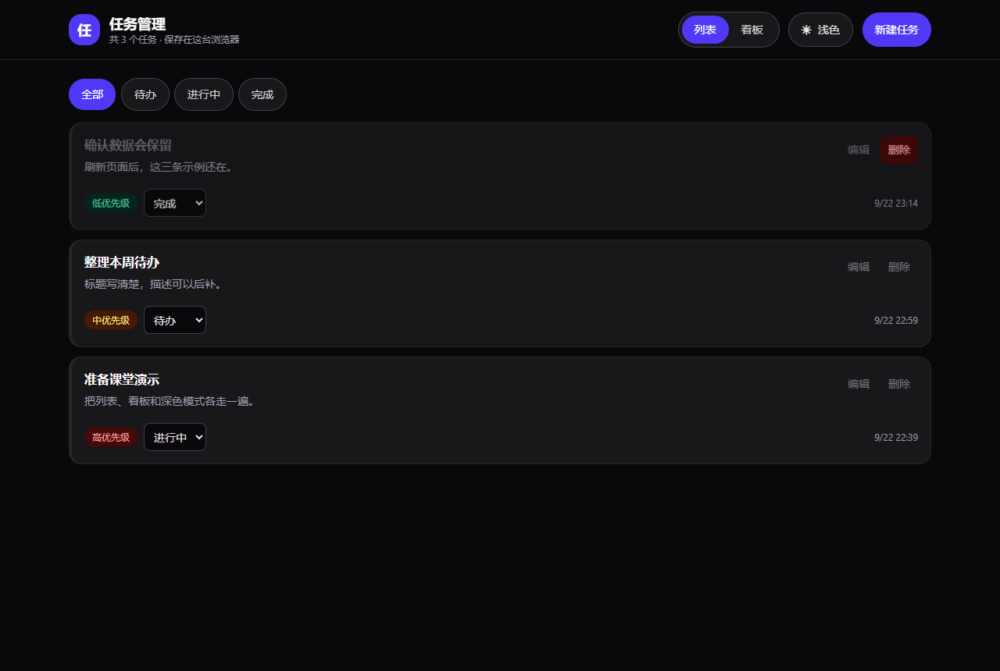

# 基于 Agent 的软件开发课堂实践：任务管理

仓库地址：https://github.com/ReneDescarteees/task-manager

用 Vue 3 + Vite + Tailwind CSS 做的任务管理应用。数据存在浏览器 `localStorage`，刷新不丢失。开发过程按「计划 → 执行 → 浏览器验证 → 提交 GitHub」推进。

## 本地运行

```bash
npm install
npm run dev
```

浏览器打开终端里显示的本地地址（默认 http://127.0.0.1:5173/ ）。

## 功能与运行截图

### 1. 任务列表：增删改查、三种状态、三档优先级

列表按创建时间倒序。每张卡片有标题、描述、优先级颜色、状态下拉、编辑和删除。

- 优先级：高（红）、中（黄）、低（绿），用左边框和标签区分
- 状态：待办 / 进行中 / 完成
- 完成的任务标题带删除线



### 2. 新建任务：标题必填，描述选填

标题留空点保存，会提示「标题不能为空」，任务不会被创建。



填写标题、描述、优先级和状态后再保存。描述可以留空。



保存后新任务出现在列表最上方，任务数从 3 变为 4。



### 3. 编辑任务

点「编辑」会打开同一张表单，标题仍必填，可以改描述、优先级和状态。



### 4. 看板：三列卡片

「列表 / 看板」切换的是同一份数据。三列分别是待办、进行中、完成。



### 5. 拖拽改状态

把「提交课堂实践材料」从「待办」拖到「进行中」。拖完后该列计数从 1 变为 2，卡片上的状态也变成「进行中」。



### 6. 深色模式

右上角一键切换。按钮文案会变成「浅色」，方便切回去。选择写入 `localStorage`，键名 `task-manager-theme`。



### 7. 刷新后数据仍在

刷新页面后：深色模式还在，刚编辑过的描述还在，拖拽后的「进行中」状态也还在。任务数据键名是 `task-manager-tasks`。



### 8. 删除任务

删除「提交课堂实践材料」后，任务数回到 3。



## 提示词设计

好的提示词 = 目标 + 约束 + 上下文。每一轮只推进一块功能，做完就在浏览器里验证，再提交到 GitHub。

### 实际使用的提示词

1. 先读要求，不直接写代码：

> 看一下课堂实践的 PPT，了解作业要求。要求要在 GitHub 上同步开发。

这一轮只确认范围：任务增删改查、三种状态、三档优先级、看板拖拽、深色模式、浏览器持久化，以及每轮 commit 后推到 GitHub。

2. 要求明确后开始实现：

> 我觉得要求已经很明确了，开始实现。

约束已经在上一轮对齐：Vue 3、Vite、Tailwind CSS、`localStorage`，并且要推到 GitHub。

3. 补提交材料：

> 功能截图可以放在 README 里面。

### 分轮提示词

每一轮都写成「做什么、不做什么、做到什么算完成」。

**第一轮：项目骨架**

> 我在做任务管理 Web 应用。技术栈是 Vue 3 + Vite + Tailwind CSS，使用 script setup。请先搭骨架，不要做业务功能。
>
> 创建 `src/types/task.ts`，字段包括 id、title、description、status、priority、createdAt、updatedAt。status 只能是 todo、in-progress、done。priority 只能是 high、medium、low。
>
> `App.vue` 先放顶部标题「任务管理」和中间内容区。主色用 indigo。完成后运行 `npm run dev`，浏览器能打开页面。

**第二轮：列表和表单**

> 做任务列表和新建/编辑弹窗，先用内存数据。
>
> 标题必填，为空时提示「标题不能为空」。描述选填。优先级用颜色区分：高红、中黄、低绿。卡片上可以编辑、删除，也可以改状态。
>
> 不要引入组件库。做完后在浏览器里新建一条、改一条、删一条。

**第三轮：持久化和深色模式**

> 把任务存进 localStorage，键名 `task-manager-tasks`。读取失败时返回空数组。初始化时加载，数据变化后自动保存。
>
> 深色模式放在导航栏右侧，一键切换，键名 `task-manager-theme`。第一次打开跟随系统，用户选过之后记住。
>
> 验证：添加任务后刷新，任务还在；切换深色后再刷新，主题还在。

**第四轮：看板拖拽**

> 增加看板视图，文件 `src/components/KanbanBoard.vue`。三列是待办、进行中、完成。用 HTML5 原生拖拽，不要拖拽库。拖到新列就更新 status。
>
> 顶部用「列表 / 看板」切换，两套视图共用同一份数据。验证：把一张卡片从待办拖到进行中，状态和列都变了，切回列表也能看到。

### 排错时用的提示词格式

> 我遇到了一个问题，帮我修复。
>
> 【错误信息】贴终端或浏览器控制台的完整报错。
>
> 【我想实现的效果】期望发生什么。
>
> 【我已经尝试过的方法】已经做过但没解决的操作。
